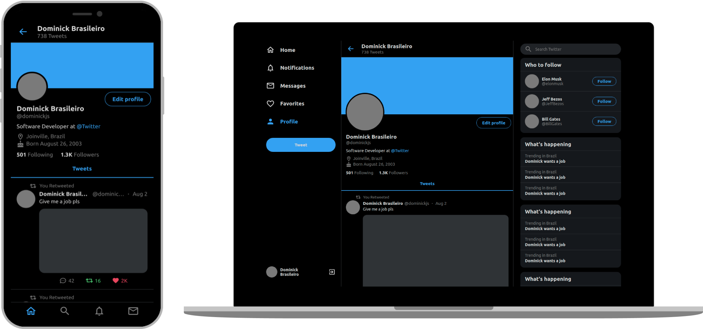

<h2 align="center">
  🐦 ReactJS Twitter Clone
</h2>

  

 

  <a href="#-technologies">Technologies</a>&nbsp;&nbsp;&nbsp;|&nbsp;&nbsp;&nbsp;
  <a href="#-about">About</a>&nbsp;&nbsp;&nbsp;|&nbsp;&nbsp;&nbsp;
  <a href="#information_source-how-to-use">How To Use</a>&nbsp;&nbsp;&nbsp;|&nbsp;&nbsp;&nbsp;
  <a href="#-license">License</a>

 

  

## 📕 About

A responsive Twitter UI Clone for study purposes.

## 🌐 Technologies

This project was developed with the following technologies:

- [React](https://reactjs.org)
- [Styled Components](https://styled-components.com)
- [TypeScript](https://www.typescriptlang.org)

## :information_source: How To Use

- Clone this repository: `git clone https://github.com/dominickbrasileiro/reactjs-twitter-clone`;
- Go into the repository: `cd reactjs-twitter-clone`;
- Install dependencies: `yarn install`;
- Run the app: `yarn start`;

## 📝 License

This project is under the MIT license. See the [LICENSE](https://github.com/dominickbrasileiro/reactjs-twitter-clone/blob/master/LICENSE) for more information.

---

Made with ❤️ by Dominick Brasileiro 💎 [Get in touch!](https://www.linkedin.com/in/dominickbrasileiro/)

